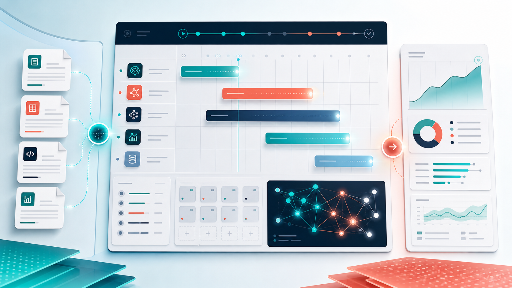
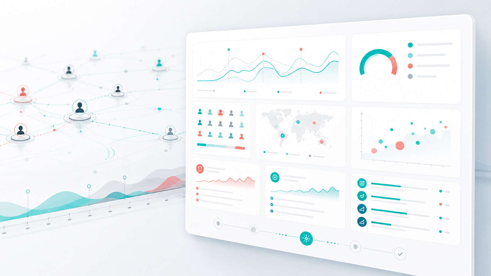

# MiroFish AI Simulation Guides for Scheduled Scenario Runs

The fastest way to get value from MiroFish is to treat every run like a scheduled decision rehearsal. You bring the source material, define the question, choose the audience dynamics, and let the simulation move from graph build to agent activity to report.

This guide is written for teams searching for **mirofish ai simulation guides** because they want a practical workflow, not another abstract explanation of what AI simulation means. Use it when you need to prepare a launch, test a narrative, compare market reactions, or pressure-test a plan before it reaches real customers, voters, employees, buyers, or communities.

Start a run from the live workspace: [open MiroFish at mirofish.my](https://mirofish.my/).



## What to Schedule in MiroFish

A good MiroFish run starts with a bounded event. The event can be a product launch, pricing update, public announcement, campaign message, policy change, market entry plan, community incident, or competitive move.

Schedule the simulation around the moment where reaction matters. Instead of asking, "Will this work?", define the operating window:

```text
Simulate the first 72 hours after our pricing update goes public.
Focus on existing customers, procurement buyers, power users, and churn-risk accounts.
Show objections, trust signals, escalation paths, and message changes worth testing.
```

That kind of prompt gives the system a time horizon, audience map, and decision output. It also makes the final report easier to review because every finding can be tied back to a real operating question.

## Prepare the Run Packet

Before opening MiroFish, assemble a run packet. The packet does not need to be perfect, but it should explain the world you want simulated.


Useful materials include product briefs, release notes, landing page drafts, customer interview notes, market research, social comments, competitor positioning, policy context, and internal decision memos.

The goal is not to upload every document your team owns. The goal is to give MiroFish enough grounded context to extract entities, relationships, incentives, claims, risks, and open questions.

[Upload your run packet to MiroFish](https://mirofish.my/).

## The MiroFish Scheduling Flow

MiroFish turns a document-backed question into a staged simulation workflow. Think of the workflow as a run schedule with five checkpoints.

## 1. Intake

The intake step captures the files, prompt, intended decision, and scenario boundary. Strong intake prompts include the event, audience groups, time period, reaction types, and output format.

## 2. Graph Build

MiroFish reads the uploaded material and builds a graph of relevant entities, relationships, topics, constraints, and signals. This graph gives the simulation memory, keeping the run tied to your actual material instead of drifting into a generic answer.

## 3. World Setup

The world setup step creates the simulation environment. Depending on the scenario, the world may include early adopters, skeptical buyers, executives, community members, analysts, journalists, employees, critics, supporters, or other relevant actors.

## 4. Simulation Run

During the run, agents react over time. They post, respond, amplify, misunderstand, support, resist, and create new pressure. The point is not to produce one confident sentence. The point is to expose how reaction may evolve when many perspectives interact.

For scheduled scenario work, watch for repeated patterns: one claim that multiple groups misunderstand, one objection that spreads faster than expected, one audience that supports the plan for a different reason than the team assumed, or one missing explanation that creates avoidable risk.

## 5. Report and Follow-Up

After the run, MiroFish generates a prediction report. Use the report as scenario intelligence. It should help you decide what to clarify, compare, rewrite, prepare, or test next.

The best follow-up is a second run with one changed variable. Compare two launch messages, two pricing explanations, two policy framings, or two escalation responses. Controlled reruns make the report more practical because you can see which change affects the simulated reaction.

## Example Schedule: Product Launch

Use this run when a team has a launch page, product brief, target customer notes, and a planned announcement.


```text
Simulate the first 48 hours after launch.
Audience groups: early adopters, skeptical buyers, founders, product managers, and industry commentators.
Focus on enthusiasm, confusion, objections, privacy concerns, pricing sensitivity, and talking points likely to spread.
Return a report with launch risks, message improvements, and follow-up content ideas.
```

Review the report for concrete edits. If the simulation shows privacy concerns, strengthen the privacy section before launch. If users ask for integrations, make that answer visible. If commentators compare the product to the wrong category, rewrite the positioning.

[Run a product launch simulation in MiroFish](https://mirofish.my/).

## Example Schedule: Public Announcement

Use this run when an organization needs to publish a statement, policy update, community decision, or external response.

```text
Simulate public reaction during the first 24 hours after this announcement.
Audience groups: supporters, critics, neutral observers, affected users, journalists, and internal employees.
Identify likely misunderstandings, criticism themes, supportive arguments, escalation risks, and the first three clarifications we should prepare.
```

This run is useful because internal clarity does not guarantee public clarity. MiroFish can surface phrases that sound reasonable in a planning room but defensive, vague, or incomplete once different audiences react.

## Example Schedule: Market Entry

Use this run when evaluating a new segment, geography, platform, or buyer category.

```text
Simulate how target buyers, incumbent competitors, analysts, and channel partners may react to our proposed market entry over 30 days.
Focus on credibility barriers, trust signals, partner incentives, competitor countermoves, and the first niche where adoption may be easiest.
```

This gives founders, strategy teams, and operators a better way to discuss market entry risk. The output is not a replacement for research. It is a structured rehearsal that helps identify what to validate next.

## How to Judge a MiroFish Report

Do not read a MiroFish report like a guarantee. Read it like an operating map.



Useful reports usually include clear audience segments, repeated reaction patterns, source-grounded assumptions, plausible risks, tactical recommendations, and follow-up questions worth simulating.

Weak reports usually trace back to weak inputs. If the report feels generic, tighten the source packet, narrow the time window, name the audience groups, or run a comparison scenario.

## Start the Next Scheduled Run

MiroFish is most useful when a real decision is close enough to describe clearly but early enough to change. Bring the documents, frame the operating window, run the simulation, and use the report to improve the plan before the outside world reacts.

[Start your next AI simulation at mirofish.my](https://mirofish.my/).
